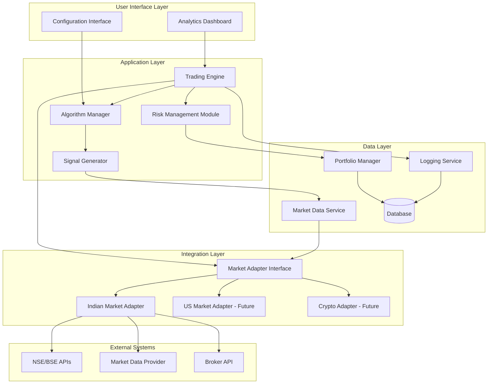

# Design Document

## Overview

The Options Trading Bot is a modular, event-driven system designed to execute algorithmic options trading strategies on Indian market indices (Nifty 50, Sensex, Bank Nifty) and commodities (Gold, Silver) with future extensibility to US markets and cryptocurrency. The system implements well-researched, market-tested algorithms that have proven effectiveness in real-world trading. The architecture prioritizes low-latency execution, capital preservation, and comprehensive analytics through backtesting and paper trading before live deployment.

The bot starts with small capital (₹10,000 INR or $100 USD) and aims to grow to target levels (₹1 Crore INR or $1 Million USD) through compounding returns and disciplined risk management.

### Key Design Principles

1. **Modularity**: Market-agnostic core with pluggable market adapters
2. **Performance**: Sub-100ms execution latency with asynchronous processing
3. **Safety**: Multi-layered risk management with capital preservation
4. **Extensibility**: Plugin architecture for custom algorithms
5. **Observability**: Comprehensive logging and real-time analytics

## Architecture

### High-Level Architecture



### System Modes

The system operates in three distinct modes:

1. **Backtesting Mode**: Simulates trading using 5 years of historical data
2. **Paper Trading Mode**: Executes simulated trades with live market data
3. **Live Trading Mode**: Executes real trades with actual capital (future phase)

### Trading Session Management

**Indian Markets (Equity & Commodities)**:
- **Pre-Market Analysis**: 9:00 AM - 9:15 AM (NSE pre-open) - Analyze opening range, volume, volatility
- **Market Entry Window**: 9:45 AM - 10:00 AM (30-45 mins after 9:15 AM open) - First trades allowed
- **Active Trading**: 10:00 AM - 3:00 PM - Normal trading operations
- **Market Exit Window**: 3:00 PM - 3:30 PM (30 mins before close) - Close all intraday positions
- **Overnight Decision**: 3:00 PM - Evaluate positions for overnight holding

**Cryptocurrency Markets (BTC/ETH)**:
- **24/7 Trading**: Continuous trading without session restrictions
- **No waiting periods**: Immediate trade execution based on signals

**Position Management**:
- **Intraday Positions**: Must be closed 30 minutes before market close
- **Overnight Positions**: Held based on profit potential and risk assessment
- **Directional Trading**: Support both bullish (long calls, short puts) and bearish (long puts, short calls) strategies

## Components and Interfaces

### 1. Trading Engine

**Responsibility**: Orchestrates the entire trading workflow from signal generation to order execution.

**Key Operations**:
- Initialize trading session with selected mode (backtest/paper/live)
- Coordinate between algorithm manager, risk management, and market adapter
- Manage order lifecycle (creation, validation, execution, monitoring)
- Handle execution errors and retry logic

**Interface**:
```python
class TradingEngine:
    def start_session(mode: TradingMode, config: TradingConfig) -> Session
    def stop_session(session_id: str) -> None
    def process_signal(signal: TradeSignal) -> OrderResult
    def get_session_status(session_id: str) -> SessionStatus
    def is_trading_allowed() -> bool  # Check if within trading window
    def should_close_intraday_positions() -> bool  # Check if near market close
    def evaluate_overnight_position(position: Position) -> bool  # Decide if hold overnight
```

### 2. Algorithm Manager

**Responsibility**: Manages built-in and custom trading algorithms, handles algorithm lifecycle and configuration.

**Built-in Algorithms** (Well-Researched and Market-Tested):

1. **Trend Following (Moving Average Crossover)**
   - Research basis: Widely documented in academic literature and used by professional traders
   - Uses 20/50 EMA crossovers with volume confirmation
   - Proven effective in trending markets with clear directional bias

2. **Mean Reversion (RSI + Bollinger Bands)**
   - Research basis: Statistical mean reversion principles, extensively backtested
   - Identifies overbought (RSI > 70) and oversold (RSI < 30) conditions
   - Combines with Bollinger Band extremes for high-probability entries
   - Particularly effective in range-bound markets

3. **Breakout Strategy (Support/Resistance)**
   - Research basis: Price action trading methodology used by institutional traders
   - Detects price breakouts from consolidation patterns with volume surge
   - Uses ATR for dynamic stop-loss placement
   - Effective during high-volatility periods and news events

4. **Volatility Trading (Straddle/Strangle)**
   - Research basis: Options pricing theory and implied volatility analysis
   - Trades based on IV percentile and expected moves
   - Exploits volatility expansion and contraction cycles
   - Well-suited for options trading on indices and commodities

5. **Iron Condor (Range-Bound Strategy)**
   - Research basis: Professional options selling strategy with defined risk
   - Profits from time decay in low-volatility environments
   - Uses probability-based strike selection
   - Popular among professional options traders for consistent income

Each algorithm has been validated through:
- Academic research papers and trading literature
- Historical backtesting across multiple market conditions
- Real-world usage by professional traders and institutions
- Statistical significance testing for edge validation

**Interface**:
```python
class AlgorithmManager:
    def register_algorithm(algo: Algorithm) -> str
    def configure_algorithm(algo_id: str, params: dict) -> None
    def enable_algorithm(algo_id: str) -> None
    def disable_algorithm(algo_id: str) -> None
    def get_active_algorithms() -> List[Algorithm]
    
class Algorithm(ABC):
    @abstractmethod
    def generate_signals(market_data: MarketData) -> List[TradeSignal]
    
    @abstractmethod
    def get_parameters() -> dict
    
    @abstractmethod
    def validate_parameters(params: dict) -> bool
```

### 3. Signal Generator

**Responsibility**: Analyzes market data using technical indicators and generates trade signals.

**Technical Indicators Implemented**:
- Moving Averages (SMA, EMA)
- Relative Strength Index (RSI)
- Moving Average Convergence Divergence (MACD)
- Bollinger Bands
- Average True Range (ATR)
- Volume Profile
- Open Interest Analysis

**Options Metrics Analyzed**:
- Greeks (Delta, Gamma, Theta, Vega, Rho)
- Implied Volatility (IV) and IV Rank/Percentile
- VIX (India VIX for market-wide volatility)
- Put-Call Ratio (PCR)
- Open Interest changes and Max Pain analysis
- Liquidity metrics (Volume, Bid-Ask spread)

**Interface**:
```python
class SignalGenerator:
    def calculate_indicators(market_data: MarketData) -> IndicatorSet
    def analyze_option_chain(option_chain: List[OptionChainData]) -> OptionChainAnalysis
    def select_optimal_strike(option_chain: List[OptionChainData], direction: Direction, criteria: dict) -> OptionChainData
    def evaluate_entry_conditions(indicators: IndicatorSet, option_analysis: OptionChainAnalysis, algo: Algorithm) -> Optional[TradeSignal]
    def evaluate_exit_conditions(position: Position, indicators: IndicatorSet, current_greeks: dict) -> Optional[ExitSignal]
    def calculate_probability_of_profit(signal: TradeSignal, option_data: OptionChainData) -> float
    def check_liquidity(option_data: OptionChainData, min_volume: int, min_oi: int) -> bool
```

### 4. Risk Management Module

**Responsibility**: Enforces capital preservation rules, position sizing, and trade validation.

**Risk Controls**:
- Per-trade risk limit (default: 2% of capital)
- Daily loss limit (default: 6% of capital)
- Maximum concurrent positions (default: 3)
- Maximum trades per day (default: 10)
- Minimum time between trades (default: 5 minutes)
- Position sizing based on Kelly Criterion or fixed percentage

**Interface**:
```python
class RiskManagementModule:
    def validate_trade(signal: TradeSignal, portfolio: Portfolio) -> ValidationResult
    def calculate_position_size(signal: TradeSignal, portfolio: Portfolio) -> int
    def check_daily_limits(portfolio: Portfolio) -> LimitStatus
    def adjust_risk_parameters(portfolio_value: float) -> None
    def evaluate_overtrading() -> bool
```

### 5. Market Adapter Interface

**Responsibility**: Abstracts market-specific operations for different exchanges and asset classes.

**Interface**:
```python
class MarketAdapter(ABC):
    @abstractmethod
    def connect() -> bool
    
    @abstractmethod
    def get_market_data(symbol: str) -> MarketData
    
    @abstractmethod
    def get_option_chain(underlying_symbol: str, expiry_date: Optional[date] = None) -> List[OptionChainData]
    
    @abstractmethod
    def get_vix() -> float
    
    @abstractmethod
    def get_historical_data(symbol: str, start_date: date, end_date: date) -> DataFrame
    
    @abstractmethod
    def place_order(order: Order) -> OrderResult
    
    @abstractmethod
    def get_order_status(order_id: str) -> OrderStatus
    
    @abstractmethod
    def cancel_order(order_id: str) -> bool
    
    @abstractmethod
    def get_supported_instruments() -> List[Instrument]
```

### 6. Indian Market Adapter

**Responsibility**: Implements market adapter for NSE/BSE exchanges.

**Key Features**:
- Integration with NSE/BSE and MCX APIs for options data
- Support for Nifty 50, Sensex, Bank Nifty options
- Support for Gold and Silver commodity options (MCX)
- Real-time data streaming via WebSocket
- Order placement through broker API (Zerodha/Upstox/etc.)
- Handling of Indian market hours and holidays
- Commodity-specific contract specifications and expiry handling
- Pre-market data collection and analysis (9:00 AM - 9:15 AM)
- Market entry window enforcement (30-45 min delay after open)
- Market exit window management (30 min before close)
- Overnight position evaluation and management

**Supported Instruments**:
- **Equity Indices**: Nifty 50, Bank Nifty, Sensex
- **Commodities**: Gold (MCX), Silver (MCX)

**Data Sources**:
- NSE India API for equity index options data and option chain
- MCX API for commodity options data and option chain
- NSE API for India VIX data
- Broker APIs for order execution and Greeks calculation
- Historical data from data providers (e.g., TrueData, Finvasia)

**Option Chain Features**:
- Real-time option chain updates with all strikes and expiries
- Greeks calculation (Delta, Gamma, Theta, Vega, Rho)
- Implied Volatility tracking and IV Rank/Percentile
- Open Interest monitoring and change detection
- Liquidity filtering based on volume and OI thresholds

### 7. Portfolio Manager

**Responsibility**: Tracks positions, cash balance, and portfolio performance.

**Interface**:
```python
class PortfolioManager:
    def get_current_value() -> float
    def get_positions() -> List[Position]
    def get_cash_balance() -> float
    def add_position(position: Position) -> None
    def close_position(position_id: str, exit_price: float) -> None
    def calculate_pnl() -> float
    def get_performance_metrics() -> PerformanceMetrics
```

### 8. Backtesting Engine

**Responsibility**: Simulates trading strategies using historical data.

**Key Features**:
- Event-driven simulation with realistic order execution
- Configurable slippage and transaction costs
- Support for multiple algorithms running simultaneously
- Walk-forward optimization
- Monte Carlo simulation for robustness testing

**Interface**:
```python
class BacktestingEngine:
    def load_historical_data(symbols: List[str], start_date: date, end_date: date) -> None
    def run_backtest(algorithms: List[Algorithm], config: BacktestConfig) -> BacktestResult
    def optimize_parameters(algo: Algorithm, param_ranges: dict) -> OptimizationResult
    def generate_report(result: BacktestResult) -> Report
```

### 9. Paper Trading System

**Responsibility**: Executes simulated trades with live market data.

**Key Features**:
- Real-time market data integration
- Simulated order execution with realistic fills
- Virtual portfolio management
- Performance tracking against backtesting results

**Interface**:
```python
class PaperTradingSystem:
    def start_paper_trading(algorithms: List[Algorithm], initial_capital: float) -> Session
    def stop_paper_trading(session_id: str) -> None
    def get_virtual_portfolio() -> Portfolio
    def simulate_order_execution(order: Order) -> OrderResult
```

### 10. Analytics Dashboard

**Responsibility**: Provides visualization and reporting for all trading activities.

**Key Features**:
- Real-time performance monitoring
- Interactive charts (equity curve, drawdown, trade distribution)
- Comparison views (backtest vs paper trading)
- Parameter sensitivity analysis
- Export capabilities (PDF, CSV, JSON)

**Technology Stack**:
- Backend: Python FastAPI for REST API
- Frontend: React with Chart.js or Plotly for visualizations
- Real-time updates: WebSocket connections

**Interface**:
```python
class AnalyticsDashboard:
    def get_equity_curve(session_id: str) -> ChartData
    def get_drawdown_chart(session_id: str) -> ChartData
    def get_trade_distribution(session_id: str) -> ChartData
    def get_performance_metrics(session_id: str) -> Metrics
    def export_report(session_id: str, format: str) -> bytes
    def compare_sessions(session_ids: List[str]) -> ComparisonData
```

### 11. Logging Service

**Responsibility**: Captures all system events, decisions, and executions for audit and debugging.

**Log Categories**:
- Trade signals with reasoning
- Order executions with timestamps
- Risk management decisions
- System errors and warnings
- Performance metrics

**Interface**:
```python
class LoggingService:
    def log_signal(signal: TradeSignal, reasoning: str) -> None
    def log_order(order: Order, result: OrderResult) -> None
    def log_risk_decision(decision: RiskDecision) -> None
    def log_error(error: Exception, context: dict) -> None
    def query_logs(filters: dict) -> List[LogEntry]
```

## Data Models

### Core Data Structures

```python
@dataclass
class MarketData:
    symbol: str
    timestamp: datetime
    open: float
    high: float
    low: float
    close: float
    volume: int
    open_interest: int
    bid: float
    ask: float
    vix: Optional[float] = None  # India VIX or relevant volatility index

@dataclass
class OptionChainData:
    underlying_symbol: str
    timestamp: datetime
    strike_price: float
    expiry_date: date
    option_type: str  # CALL or PUT
    last_price: float
    bid: float
    ask: float
    volume: int
    open_interest: int
    implied_volatility: float
    delta: float
    gamma: float
    theta: float
    vega: float
    rho: float
    iv_rank: Optional[float] = None  # IV percentile rank
    iv_percentile: Optional[float] = None
    
@dataclass
class TradeSignal:
    signal_id: str
    timestamp: datetime
    symbol: str
    direction: Direction  # LONG or SHORT
    signal_type: SignalType  # ENTRY or EXIT
    algorithm_id: str
    probability_of_profit: float
    reasoning: str
    indicators: dict
    
@dataclass
class Order:
    order_id: str
    symbol: str
    order_type: OrderType  # MARKET, LIMIT
    direction: Direction
    quantity: int
    price: Optional[float]
    timestamp: datetime
    
@dataclass
class Position:
    position_id: str
    symbol: str
    direction: Direction
    entry_price: float
    quantity: int
    entry_time: datetime
    current_price: float
    unrealized_pnl: float
    
@dataclass
class Portfolio:
    portfolio_id: str
    initial_capital: float
    current_value: float
    cash_balance: float
    positions: List[Position]
    realized_pnl: float
    unrealized_pnl: float
    
@dataclass
class PerformanceMetrics:
    total_return: float
    annualized_return: float
    max_drawdown: float
    sharpe_ratio: float
    win_rate: float
    profit_factor: float
    total_trades: int
    avg_trade_duration: timedelta
```

### Configuration Models

```python
@dataclass
class TradingConfig:
    mode: TradingMode  # BACKTEST, PAPER, LIVE
    market: Market  # INDIAN, US, CRYPTO
    initial_capital: float
    target_capital: float
    currency: Currency
    enabled_algorithms: List[str]
    risk_parameters: RiskParameters
    market_entry_delay_minutes: int = 30  # Wait time after market open
    market_exit_buffer_minutes: int = 30  # Close positions before market close
    allow_overnight_positions: bool = True
    overnight_position_criteria: dict = None  # Criteria for holding overnight
    
@dataclass
class RiskParameters:
    max_position_size_pct: float = 0.02  # 2% per trade
    max_daily_loss_pct: float = 0.06  # 6% daily loss limit
    max_concurrent_positions: int = 3
    max_trades_per_day: int = 10
    min_trade_interval_minutes: int = 5
    stop_loss_pct: float = 0.05  # 5% stop loss
    take_profit_pct: float = 0.10  # 10% take profit
```

## Error Handling

### Error Categories

1. **Market Data Errors**: Connection failures, data delays, missing data
2. **Execution Errors**: Order rejections, insufficient funds, invalid parameters
3. **System Errors**: Database failures, API timeouts, resource exhaustion
4. **Algorithm Errors**: Invalid signals, calculation errors, parameter violations

### Error Handling Strategy

```python
class ErrorHandler:
    def handle_market_data_error(error: MarketDataError) -> None:
        # Retry with exponential backoff
        # Fall back to cached data if available
        # Alert user if critical
        
    def handle_execution_error(error: ExecutionError) -> None:
        # Log error with full context
        # Attempt order cancellation if needed
        # Update portfolio state
        # Notify user
        
    def handle_system_error(error: SystemError) -> None:
        # Log critical error
        # Attempt graceful shutdown
        # Preserve system state
        # Send alert to administrator
```

### Circuit Breaker Pattern

Implement circuit breakers to prevent cascading failures:
- Stop trading after consecutive execution failures (threshold: 3)
- Pause algorithm after consecutive bad signals (threshold: 5)
- Halt system after critical errors

## Testing Strategy

### Unit Testing

- Test each component in isolation with mocked dependencies
- Focus on business logic, calculations, and edge cases
- Target: 80%+ code coverage

**Key Test Areas**:
- Technical indicator calculations
- Risk management rules
- Position sizing algorithms
- Signal generation logic

### Integration Testing

- Test component interactions with real dependencies
- Validate data flow through the system
- Test market adapter implementations

**Key Test Scenarios**:
- End-to-end signal generation to order execution
- Portfolio updates after trade execution
- Risk management blocking invalid trades

### Backtesting Validation

- Validate backtesting engine against known historical scenarios
- Compare results with manual calculations
- Test edge cases (market gaps, extreme volatility)

### Paper Trading Validation

- Run paper trading for minimum 30 days before live deployment
- Compare paper trading results with backtesting expectations
- Monitor for data quality issues and execution anomalies

### Performance Testing

- Load testing for concurrent market data streams
- Latency testing for order execution pipeline
- Stress testing with high-frequency signal generation

**Performance Targets**:
- Market data processing: < 10ms per update
- Signal generation: < 50ms per calculation
- Order execution: < 100ms end-to-end
- Dashboard updates: < 200ms latency

## Technology Stack

### Backend
- **Language**: Python 3.11+
- **Framework**: FastAPI for REST API
- **Async**: asyncio for concurrent operations
- **Data Processing**: pandas, numpy for calculations
- **Technical Analysis**: TA-Lib for indicators
- **Database**: PostgreSQL for persistent storage, Redis for caching
- **Message Queue**: RabbitMQ for event-driven architecture

### Frontend
- **Framework**: React 18+
- **State Management**: Redux Toolkit
- **Charts**: Plotly.js or Chart.js
- **UI Components**: Material-UI or Ant Design
- **Real-time**: WebSocket for live updates

### Infrastructure
- **Containerization**: Docker
- **Orchestration**: Docker Compose (development), Kubernetes (production)
- **Monitoring**: Prometheus + Grafana
- **Logging**: ELK Stack (Elasticsearch, Logstash, Kibana)

### Market Data & Execution
- **Indian Equity Markets**: NSE API, BSE API
- **Indian Commodity Markets**: MCX API for Gold and Silver
- **Broker APIs**: Zerodha Kite, Upstox, Angel One
- **Data Providers**: TrueData, Finvasia, or similar
- **WebSocket**: For real-time data streaming

## Security Considerations

1. **API Key Management**: Store credentials in environment variables or secret management service
2. **Authentication**: JWT-based authentication for dashboard access
3. **Authorization**: Role-based access control (admin, trader, viewer)
4. **Data Encryption**: Encrypt sensitive data at rest and in transit
5. **Audit Logging**: Log all user actions and system decisions
6. **Rate Limiting**: Prevent API abuse and excessive requests

## Deployment Strategy

### Phase 1: Backtesting (Weeks 1-4)
- Implement core components and backtesting engine
- Load 5 years of historical data
- Run comprehensive backtests
- Generate detailed reports
- Optimize algorithm parameters

### Phase 2: Paper Trading (Weeks 5-8)
- Implement paper trading system
- Connect to live market data
- Run paper trading for 30+ days
- Monitor performance vs backtesting
- Fine-tune algorithms based on results

### Phase 3: Live Trading (Week 9+)
- Start with minimum capital (₹10,000)
- Monitor closely for first 2 weeks
- Gradually increase confidence and capital allocation
- Continuous monitoring and optimization

## Monitoring and Observability

### Key Metrics to Monitor

**Trading Metrics**:
- Win rate, profit factor, Sharpe ratio
- Average trade duration and P&L
- Daily/weekly/monthly returns
- Maximum drawdown

**System Metrics**:
- Order execution latency
- Market data latency
- API error rates
- System uptime

**Risk Metrics**:
- Current exposure vs limits
- Daily P&L vs limits
- Number of rejected trades
- Overtrading indicators

### Alerting Rules

- Alert on daily loss limit approaching (80% threshold)
- Alert on execution latency exceeding 150ms
- Alert on market data connection failures
- Alert on paper trading performance deviation > 20% from backtest
- Alert on system errors or crashes

## Future Enhancements

### US Market Support
- Implement US Market Adapter for major indices (S&P 500, NASDAQ, Dow Jones)
- Integrate with US broker APIs (Interactive Brokers, TD Ameritrade)
- Handle US market hours and regulations

### Cryptocurrency Support
- Implement Crypto Market Adapter for Bitcoin and Ethereum
- Integrate with crypto exchanges (Binance, Coinbase, Kraken)
- Handle 24/7 trading and crypto-specific risks

### Advanced Features
- Machine learning models for signal generation
- Sentiment analysis from news and social media
- Multi-timeframe analysis
- Portfolio optimization across multiple strategies
- Automated parameter tuning with genetic algorithms
