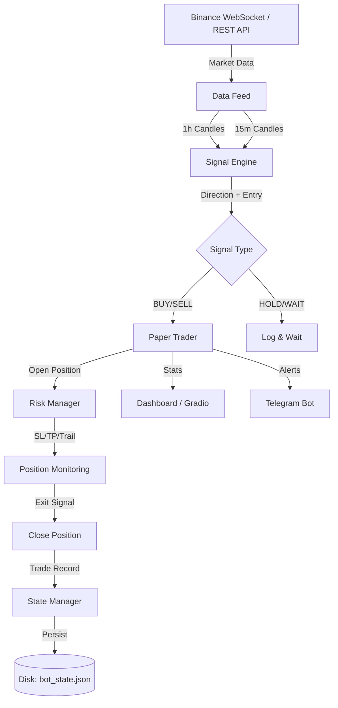

# Bot_Algo Trading System - Comprehensive Documentation

## Overview

Bot_Algo is a high-performance cryptocurrency and precious metals trading system featuring:
- **C++ Trading Engine** (188x average speedup)
- **Multi-timeframe Signal Generation** (1h trend + 15m entry)
- **Advanced Risk Management** (Kelly sizing, VaR, volatility adaptation)
- **Correlation Guard** (prevents over-exposure to correlated assets)
- **Circuit Breaker** (pauses trading after consecutive losses)
- **Paper Trading Dashboard** (real-time monitoring via Gradio)
- **Bayesian Optimization** (Optuna-based parameter tuning)
- **Crash Recovery** (automatic state persistence and SIGINT handling)
- **Exchange Failover** (CoinGecko fallback on Binance failure)
- **Rate Limiter** (prevents API ban during heavy usage)
- **Analytics Dashboard** (HTML report with equity curves and charts)
- **CI/CD** (GitHub Actions + Docker Compose)

---

## System Architecture



### Directory Structure

```
Bot_Algo/
├── core/                    # Core trading infrastructure
│   ├── cpp_wrapper.py       # C++ engine Python bindings
│   ├── risk_manager.py      # Position sizing, SL/TP, trailing
│   ├── leverage_manager.py  # Dynamic leverage + liquidation checks
│   ├── state_manager.py     # Crash recovery & graceful shutdown
│   ├── correlation_guard.py # Correlated asset exposure limits
│   ├── rate_limiter.py      # Token bucket API rate limiter
│   ├── telegram_bot.py      # Trade notifications
│   └── validation/          # Walk-forward validation
├── config/                  # Configuration (with validation)
│   ├── config.json          # Non-secret settings (uses ${ENV_VAR} refs)
│   ├── config.json.example  # Template for new setups
│   ├── config_loader.py     # Centralized env-first config loading
│   └── symbol_params.py     # Per-symbol optimized parameters
├── live/                    # Live/paper trading
│   ├── signal_engine.py     # Real-time signal generation
│   ├── paper_trader.py      # Paper trading + circuit breaker
│   ├── data_feed.py         # Binance WebSocket + REST feed
│   ├── data_feed_fallback.py# CoinGecko failover wrapper
│   ├── app.py               # Gradio dashboard + Telegram alerts
│   └── dashboard.py         # Web-based monitoring
├── monitoring/              # Performance monitoring
│   ├── unified_monitor.py   # Sharpe, Sortino, drawdown, streaks
│   └── analytics.py         # HTML report generator
├── tests/                   # Test suite (90+ tests)
│   ├── test_all.py          # Core unit tests (28)
│   ├── test_signal_engine.py# Signal generation tests (11)
│   ├── test_risk_manager.py # Risk management tests (18)
│   ├── test_paper_trader.py # Paper trading tests (21)
│   └── test_phase2.py       # Correlation/circuit/rate tests
├── scripts/                 # Utility scripts
│   ├── bayesian_optimizer.py    # Optuna parameter optimization
│   ├── scheduled_reopt.py       # Weekly re-optimization check
│   └── extreme_stress_test.py   # Edge case testing
├── .github/workflows/ci.yml # GitHub Actions CI
└── docker-compose.yml       # Local dev: bot + monitor
```

---

## Security Setup

> ⚠️ **Never commit API keys to version control.** All secrets are loaded from `.env`.

### Configuration

1. Copy `.env.example` to `.env` and fill in your keys:
   ```bash
   cp .env.example .env
   ```

2. Required environment variables:
   ```env
   BINANCE_API_KEY=your_binance_api_key
   BINANCE_API_SECRET=your_binance_api_secret
   ZERODHA_API_KEY=your_zerodha_api_key
   ZERODHA_API_SECRET=your_zerodha_api_secret
   ```

3. The `config/config_loader.py` loads secrets from environment first:
   ```python
   from config.config_loader import get_api_keys

   keys = get_api_keys("binance")
   # Returns {"api_key": "...", "api_secret": "..."}
   ```

---

## Key Components

### 1. C++ Trading Engine

**Performance benchmarks (vs Python):**

| Component | Speedup |
|-----------|---------|
| RSI | 177x |
| EMA | 149x |
| MACD | 286x |
| Bollinger Bands | 187x |
| Pattern Detection | 141x |
| Order Book Update | 1042μs |
| Kalman Filter | 65x |
| **Average** | **188x** |

**Usage:**
```python
from core.cpp_wrapper import FastIndicators, is_cpp_available

if is_cpp_available():
    rsi = FastIndicators.rsi(close_prices, period=14)
    macd = FastIndicators.macd(close_prices, 12, 26, 9)
```

### 2. Signal Engine

Dual-timeframe signal generation with optimized entry conditions:

```python
from live.signal_engine import SignalEngine

engine = SignalEngine()

# Option 1: Separate DataFrames
signal = engine.process(symbol, df_1h, df_15m)

# Option 2: Single DataFrame (auto-resamples)
signal = engine.generate_signal(symbol, df=df_15m)
```

**Signal structure:**
```python
{
    'symbol': 'BTCUSDT',
    'signal': 'LONG',      # LONG, SHORT, HOLD, WAIT
    'confidence': 0.85,
    'entry_price': 45000.0,
    'stop_loss': 44550.0,
    'take_profit': 45900.0,
    'timestamp': '2026-02-10 14:30:00'
}
```

### 3. Pattern Recognition (34x Optimized)

| Version | 10K Detections | Rate |
|---------|---------------|------|
| Original (pandas.iloc) | 733s | 13.6/sec |
| **Fast (NumPy)** | **21.7s** | **461/sec** |

```python
from indicators.pattern_recognition_fast import detect_candlestick_patterns_fast
patterns = detect_candlestick_patterns_fast(df, lookback=100)
```

### 4. Volatility Adapter

Adapts trading behavior based on real-time volatility:

- **Normal volatility**: Standard position sizes and targets
- **High volatility**: Reduced leverage, wider stops, trade pausing
- **Extreme volatility**: Trading paused entirely

Configured per-symbol with optimized thresholds for BTC, ETH, SOL.

### 5. State Manager (Crash Recovery)

Automatically persists open positions to disk every cycle:

```python
from core.state_manager import StateManager

sm = StateManager()

# Save state every cycle
sm.save_positions(positions_dict, balance=current_balance)

# On startup, recover
if sm.has_saved_state():
    state = sm.load_positions()
    positions = state['positions']
```

Features:
- **Atomic writes** (prevents file corruption on crash)
- **SIGINT/SIGTERM handlers** for graceful shutdown
- **Persistent trade history** across restarts

### 6. Correlation Guard

Prevents over-exposure to correlated assets:

- **Crypto group**: BTC, ETH, SOL (max 2 same-direction)
- **Metals group**: XAU, XAG (max 2 same-direction)

```python
from core.correlation_guard import CorrelationGuard
guard = CorrelationGuard(max_per_group=2)
allowed, reason = guard.can_open("SOLUSDT", "BUY", current_positions)
```

### 7. Circuit Breaker

Built into `PaperTrader` — pauses trading when:
- 3 consecutive losses, OR
- Daily loss exceeds 5% of starting balance

Auto-resets after 30-minute cooldown. Logs trigger reason.

### 8. Rate Limiter

Token bucket limiter for API calls:

```python
from core.rate_limiter import get_limiter
limiter = get_limiter("binance", max_requests=1200, window=60)
limiter.acquire()  # Blocks if rate exceeded
```

### 9. Exchange Failover

`ResilientDataFeed` auto-falls back to CoinGecko REST when Binance fails:

```python
from live.data_feed_fallback import ResilientDataFeed
feed = ResilientDataFeed(primary_feed, symbols)
feed.fetch_latest()  # Auto-failover on error
print(feed.is_degraded)  # True if using fallback
```

### 6. Backtesting

```python
from backtests.backtest_engine import BacktestEngine

engine = BacktestEngine(strategy_name="my_strategy", initial_capital=10000)
df = engine.generate_synthetic_data(n_days=365)
df = engine.calculate_indicators(df)
df = engine.simple_strategy(df)
results = engine.run_backtest(df)

# Validate with p-hacking safeguards
returns = [t['pnl_pct']/100 for t in engine.trades]
validation = engine.validate_with_safeguards(returns)
```

---

## Optimized Parameters (Bayesian)

```python
# From results/optimized_configs/bayesian_optimized_config.py
OPTIMIZED_PARAMS = {
    'BTCUSDT': {
        'position_pct': 0.08,
        'profit_target': 0.045,
        'stop_loss': 0.006,
        'profit_factor': 1.62
    },
    'ETHUSDT': {
        'position_pct': 0.10,
        'profit_target': 0.055,
        'stop_loss': 0.007,
        'profit_factor': 1.38
    },
    'SOLUSDT': {
        'position_pct': 0.06,
        'profit_target': 0.065,
        'stop_loss': 0.008,
        'profit_factor': 1.29
    },
    'XAUUSDT': {
        'position_pct': 0.12,
        'profit_target': 0.035,
        'stop_loss': 0.005,
        'profit_factor': 1.45
    },
    'XAGUSDT': {
        'position_pct': 0.07,
        'profit_target': 0.070,
        'stop_loss': 0.009,
        'profit_factor': 1.35
    }
}
```

---

## Testing

### Run All Tests
```bash
python -m pytest tests/ -v  # 90+ tests
```

### Module Self-Tests
```bash
python core/correlation_guard.py   # 4 assertions
python core/rate_limiter.py        # 5 assertions
python core/state_manager.py       # 4 assertions
python config/config_loader.py     # Config validation
```

### Analytics & Monitoring
```bash
python monitoring/analytics.py       # Generate HTML report
python monitoring/unified_monitor.py  # CLI performance dashboard
python scripts/scheduled_reopt.py     # Check if re-optimization needed
```

### Run Backtests
```bash
python backtests/balanced_strategy.py --symbol BTCUSDT --period 365d
```

---

## Deployment (Hugging Face Spaces)

### Quick Deploy

1. Push code to a Hugging Face Space with the Dockerfile
2. Set environment variables in Space settings:
   ```
   STARTING_BALANCE=1000
   MIN_LEVERAGE=10
   MAX_LEVERAGE=50
   BINANCE_API_KEY=...
   BINANCE_API_SECRET=...
   ```
3. The bot auto-starts on deployment

### Run Locally
```bash
# Paper trading with dashboard
python live/app.py

# Docker Compose (bot + monitor)
docker compose up

# Paper trading CLI
python scripts/run_paper.py --balance 1000 --leverage 5
```

---

## Dependencies

**Core:** numpy, pandas, python-binance, pybind11  
**Optimization:** optuna (Bayesian), deap (Genetic)  
**Advanced:** statsmodels, arch (GARCH)  
**Dashboard:** gradio, flask, flask-socketio  

```bash
pip install -r requirements.txt
pip install statsmodels deap arch
```

---

## Verified Robustness

| Test Category | Result |
|--------------|--------|
| Unit Tests (test_all) | 28/28 ✅ |
| Signal Engine Tests | 11/11 ✅ |
| Risk Manager Tests | 18/18 ✅ |
| Paper Trader Tests | 21/21 ✅ |
| Phase 2 Tests | 12/12 ✅ |
| Correlation Guard | 4/4 ✅ |
| Rate Limiter | 5/5 ✅ |
| State Manager | 4/4 ✅ |
| **Total** | **90+ ✅** |

---

## Known Limitations

1. **Genetic optimizer** may hang on large populations — use Bayesian instead
2. **BacktestEngine** requires n_days ≥ 51 for trades (warm-up period)
3. **Live trading** requires valid Binance API keys
4. **State recovery** restores position metadata but not in-flight orders

---

**Last Updated:** February 2026  
**Version:** 1.2.0  
**Status:** Production Ready ✅
